# Generated Question Quality Flow

## Scope

Chỉ xử lý generated question object/list/wrapper `generatedQuestions`. Không dùng question_plan, raw question/raw answer, PDF/OCR hoặc pipeline khác.

## Flow



```text
Generated question
→ Structural validator bằng code
→ LLM Solution Quality Judge (dùng Judge hiện có)
→ Solution quality gate
→ LLM Solution Resolver khi solution đạt gate
→ Normalize/deduplicate issues
→ Scoped repair nếu auto_repair=true
→ Compact output
```

### Solution correctness pipeline

```text
Context & Transition Builder
→ blocking context: code tạo canonical issue và dừng
→ context available: code tạo ordered transitions
→ Splitter mô tả mỗi ảnh/bảng/đồ thị thành text và code chèn vào stem nội bộ
→ Code Transition Analyzer gắn code_analysis vào từng transition
→ Gemma 4 26B Correctness đọc transition + cảnh báo hard-invalid (nếu có), chỉ đánh giá đúng/sai toán học
→ Gemma 4 12B Process/Presentation đánh giá độ đầy đủ của lời giải mẫu và chất lượng trình bày
→ nếu output không canonical: dùng chung tối đa một contract-correction call cho object
→ Aggregate nhận hai kết quả Judge canonical
```

Với object có ảnh HTTP(S), chỉ Gemma 12B Splitter nhận `image_url`.
Splitter trả `visual_descriptions` có `source_path`, `asset_url` và mô tả tiếng
Việt cho từng ảnh. Code kiểm tra mỗi ảnh được mô tả đúng một lần rồi chỉ chèn mô
tả vào bản stem nội bộ dùng cho Correctness; generated question gốc không bị sửa.
Correctness và contract-correction chỉ nhận mô tả text, không tải lại ảnh. Nếu
Splitter không đọc được ảnh, context được đánh dấu `insufficient` và flow dừng
trước hai Judge.

Code Transition Analyzer không gọi model, không tạo public issue và không quyết
định `is_good`. Analyzer chỉ hỗ trợ tập hẹp gồm số học, phương trình/bất phương
trình tuyến tính một ẩn, chuyển vế, phép toán hai vế, thay số, khai triển/rút gọn
đa thức đơn giản, chuỗi đẳng thức, đơn thức bậc lẻ trong phạm vi an toàn và đếm thao tác cơ bản. Căn, logarit, phân thức
có biến, nguy cơ mất/sinh nghiệm và suy luận bằng ngôn ngữ được trả về
`unsupported`, `ambiguous` hoặc `parse_error` để Gemma tự đánh giá.

Mỗi annotation nội bộ vẫn có `status`, `strength`, `transition_type`, `issue_type`,
`operation_count`, `operation_types` và `reason`. Tuy nhiên Correctness chỉ nhận
`verified_invalid + hard` như một cảnh báo số học một chiều; các annotation valid,
soft, compressed, unsupported và operation count không được đưa vào prompt
Correctness. `missing_major_step` do Process/Presentation quyết định từ nguyên văn
lời giải. Annotation không xuất hiện trong public API/CLI output.

Không còn Claim Role Verifier riêng. Correctness đọc raw state cùng cảnh báo hard
và tự xác định claim được dùng tiếp, bị sửa/bác bỏ hay chỉ được nêu làm phản ví
dụ. Correctness chỉ được bỏ qua cảnh báo khi có bằng chứng rõ ràng trong lời giải;
Analyzer vẫn không tự quyết định public verdict.

Structural validator chỉ kiểm tra shape/reference/cardinality/render schema cơ bản; không đọc semantic solution hoặc hint.

Solution Resolver là nguồn semantic duy nhất cho:

- final answer và cardinality theo interaction type;
- map solution sang option/expected;
- answerSpec mismatch;
- hint alignment khi solution resolved;
- solution thiếu kết luận hoặc có nhiều đáp án cuối không hợp lệ.

Correctness và Solution Resolver luôn gọi Gemma 4 26B ngay từ primary. Correctness và Process/Presentation dùng chung ngân sách tối đa một contract-correction call cho mỗi object. Nếu chỉ một nhánh invalid, chính model của nhánh đó sửa raw candidate theo exact contract error. Nếu cả hai invalid, một call 26B trả strict flat contract kép; code tách ra rồi chạy validator, invariant, anchor và grounding độc lập cho từng nhánh. Nếu bất kỳ nhánh nào vẫn invalid thì fail-closed, không Aggregate output partial. Model Process chỉ trả verdict, loại lỗi và anchor, còn code tự dựng path/evidence. Solution Resolver chỉ gọi model đúng một lần; lỗi contract, runtime hoặc `needs_manual_review` đều fail-closed và không kích hoạt Resolver fallback. Không fallback Correctness về 12B.

Nếu một trong hai Judge không có output hợp lệ sau correction duy nhất, flow dừng trước Resolver và scoped repair. Không được căn chỉnh answerSpec/options/hints khi chất lượng solution chưa được xác minh.

Context & Transition Builder là nơi duy nhất xác định context bắt buộc. Nếu requirement đã validate có `availability=missing/insufficient`, code tạo canonical issue và dừng trước Correctness, Process/Presentation và Resolver. Khi context đầy đủ, hai Gemma chuyên biệt chạy song song: Correctness Judge nhận question context và ordered stages để kiểm tra phép tính, suy luận, điều kiện, nghiệm, nhánh và lỗi toán học đầu tiên; Process & Presentation Judge nhận ordered solution states để kiểm tra `missing_major_step`, đoạn nháp, tự vấn, thử-sai, mâu thuẫn trình bày, lặp lại, dài dòng và wording. Correctness không đánh giá gộp bước; Process không tính lại toán học.

Trước Judge, Gemma 4 12B Splitter nhận `image_url` đúng một lần, trả ordered states nguyên văn và một mô tả grounded cho từng ảnh. Code kiểm tra source_path/asset_url, chèn mô tả vào bản sao stem hoặc instruction chỉ dùng nội bộ rồi gửi text đó cho Correctness; object và public output không bị sửa. Correctness không nhận lại ảnh hoặc tải URL. Code Splitter là fallback deterministic cuối cùng. Code kiểm tra order/source_path, bảo toàn text gốc và ghép states liền kề thành stage cố định. Correctness chỉ nhận candidate `verified_invalid + hard` đã rút gọn, không nhận operation count hay nhãn compressed; Process/Presentation đọc nguyên văn states và không nhận verdict toán học từ Analyzer. Sau đó hai Judge chạy song song và dùng chung tối đa một correction call; Resolver mismatch vẫn fail-closed.

Nếu Judge tạo `solution_quality/clean_solution_reasoning`, flow ưu tiên làm sạch rồi check lại solution. Nếu Judge tạo `solution_quality/needs_manual_review`, flow dừng semantic alignment và không gọi Resolver. Trường hợp thiếu bảng/hình/đồ thị cần thiết trong JSON cũng đi theo nhánh manual review này. Chỉ solution vượt qua gate mới được dùng để đối chiếu answerSpec/options/hints.

## Repair

- `align_fields_to_solution`: resolver resolved và có `fields_to_fix` hợp lệ; chỉ sửa answerSpec/expected.
- `align_hint_to_solution`: resolver resolved và hint mâu thuẫn trực tiếp với solution.
- `clean_solution_reasoning`: bỏ thử-sai/tự vấn/đoạn nháp, giữ nguyên final answer.
- `fix_schema`: patch structural/render nhỏ.
- Không full repair, không tự giải lại bài, không tạo đáp án mới.
- Resolver `needs_manual_review` thì không sửa answerSpec/options/hints/solution.
- Thứ tự repair là solution trước, sau đó mới đến `align_fields_to_solution`, `align_hint_to_solution` và các sửa chữa khác.

## Issue/output

Issue được deduplicate theo `category + location + repair_intent + normalized reason`. `issues` là danh sách public duy nhất. Debug chỉ thêm kết quả resolver dạng ngắn, trạng thái repair, patch, số vòng và lý do dừng; không trả `error_snippet`, `required_context_paths`, `fields_to_fix`, danh sách issue lặp trong resolver hoặc `selected_issue`.

Compact item:

```json
{
  "id": "...",
  "is_good": true,
  "issues": [],
  "new_generated_question": null
}
```

Report mặc định chỉ có bảng một dòng mỗi record:

`# | ID | Status | Repair | Issues | Failed Reason | Suggestions`

## Public API/CLI

Generated endpoint nhận `strict_mode`, `debug`, `auto_repair`, `max_loop` và `workers`; `max_loop` clamp 1..3, `workers` giới hạn 1..4 và mặc định là 3 ở CLI/API.

```bash
python cli.py --evaluate-generated-questions-service --input data/processed/math_9_bt_test.json
python cli.py --evaluate-generated-questions-service --input data/processed/math_9_bt_test.json --auto-repair --max-loop 3
python cli.py --evaluate-generated-questions-service --input data/processed/math_9_bt_test.json --auto-repair --max-loop 3 --debug
```
