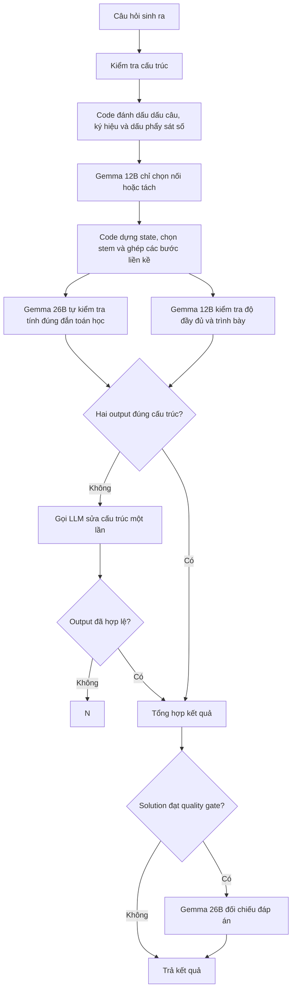

# Luồng đánh giá chất lượng câu hỏi hiện tại

Correctness nhận ngữ cảnh đề và các transition theo thứ tự, bắt buộc điền checklist cho từng cặp `Đề → A`, `A → B`, ... (reason trước, `is_valid` sau), tự kiểm tra context
Process nhận cùng chuỗi transition, bao gồm cặp đầu từ đề đến state 0, để kiểm tra thiếu cầu nối, bước thừa và chất lượng trình bày; Process không xác minh lại phép toán.
cùng toàn bộ toán học. Process/Presentation nhận nguyên văn các semantic state và tự quyết định lời
giải có thiếu bước chính hoặc có vấn đề trình bày hay không. Transition Builder
chỉ tổ chức dữ liệu, không sinh nhận định toán học cho hai model.
